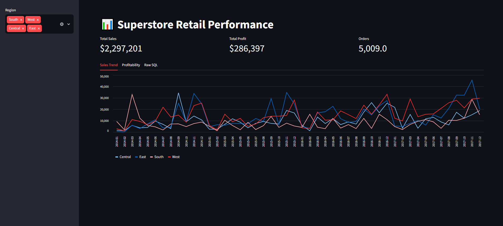
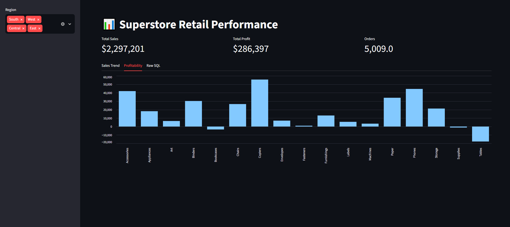
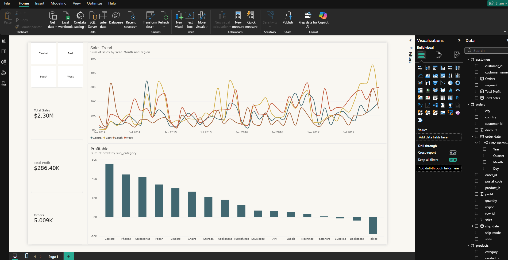

# Superstore Retail Performance

A SQL-led data analysis project on the Kaggle Superstore dataset — loaded into a relational SQLite database, analyzed with analyst-grade SQL (CTEs, window functions, joins), and visualized in both Power BI and a live Streamlit dashboard.

🔗 **Live demo:** https://superstore-retail-store-performance-kmxkoa5ia6x6maxcmhihev.streamlit.app/
📊 **Power BI file:** [Download .pbix](https://drive.google.com/drive/folders/1DPe9rFSritmr2KMD36etx6-dL8lXKgdh?usp=sharing)

## Overview

Superstore's ~10K order line items were loaded into a normalized SQLite schema (`customers`, `products`, `orders`) and analyzed with 12 SQL queries covering growth trends, profitability, customer value, and retention — the kind of questions a retail analyst would actually be asked.

**Headline numbers (2014–2017, all regions):**
- Total Sales: **$2,297,201**
- Total Profit: **$286,397**
- Orders: **5,009**

## Tech stack
- **Database:** SQLite (schema written in Postgres-compatible SQL)
- **Analysis:** Python (pandas, sqlite3) in Jupyter
- **Dashboards:** Power BI + Streamlit (Python/pandas)

## Project structure
```
├── superstore.csv # raw dataset
├── superstore.db # SQLite database
├── data.ipynb # load, schema, analysis notebook
├── schema.sql # DDL — normalized schema
├── queries.sql # all 12 analysis queries
├── app.py # Streamlit dashboard
├── customers.csv / orders.csv / products.csv # exports for Power BI
└── powerbipage1.png, streamlitpage1.png, streamlitpage2.png # screenshots
```

## Schema

Normalized into three tables — `customers`, `products`, `orders` — joined on `customer_id` / `product_id`. Full DDL in [`schema.sql`](schema.sql).

## Key findings

- **Tables and Bookcases are the only sub-categories losing money** — Tables shows a sharply negative profit total despite meaningful sales volume, driven by heavy discounting.
- **Copiers, Phones, and Accessories are the most profitable sub-categories**, each contributing well over $40K in profit.
- **Sales are strongly seasonal**, with a consistent Q4 spike (Nov–Dec) across all four years — visible clearly in the regional trend line.
- **[FILL IN]** — top customer by lifetime value: e.g. "*Sean Miller* leads with $X,XXX in total sales."
- **[FILL IN]** — repeat purchase rate: e.g. "Customers acquired in early cohorts show a ~XX% repeat purchase rate."

## The 12 SQL questions answered
1. Month-over-month sales growth by region (window function: `LAG`)
2. Profit margin by sub-category (CTE + join)
3. Customer LTV ranked within segment (`RANK() OVER`)
4. Top 5 loss-making sub-categories
5. Discount level vs. average profit margin
6. Top 10 customers by lifetime value
7. Repeat purchase rate by first-order cohort month
8. Shipping mode vs. average delivery delay
9. Category profitability vs. sales volume
10. State-level sales concentration (Pareto / cumulative %)
11. Order frequency per customer segment
12. Seasonal sales trend by month/year

Full queries in [`queries.sql`](queries.sql).

## Dashboards

**Streamlit** (interactive, filterable by region):



**Power BI** (same underlying data, desktop BI tooling):


## Running it locally
```bash
pip install streamlit pandas
streamlit run app.py
```